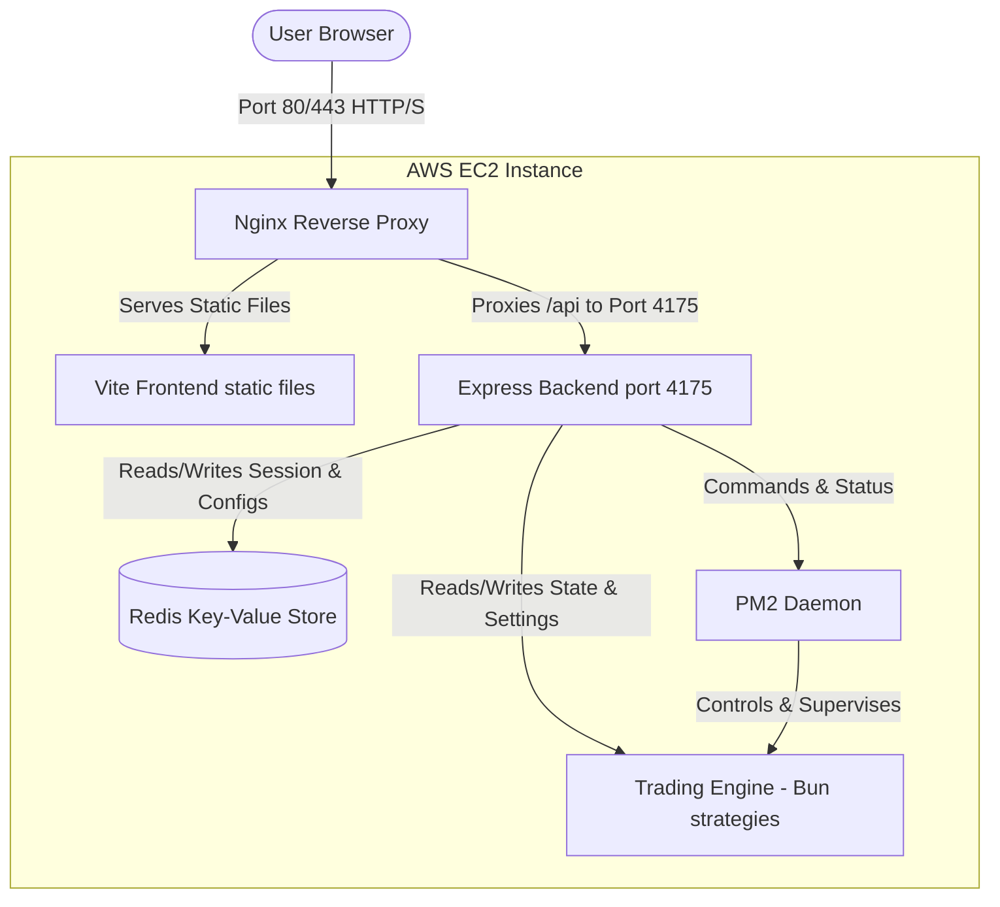
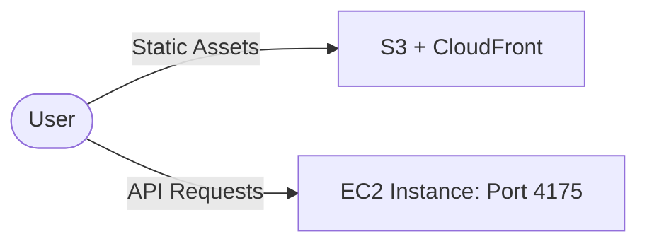

# AWS Deployment Guide: Poly Engine

Because the **Web UI Backend** and the **Trading Engine** share a local filesystem (reading logs, state files, and managing strategies via PM2 programmatically), **they must be deployed on the same AWS EC2 instance**.

Here are the two primary deployment strategies on AWS. We highly recommend **Option 1** for simplicity, security, and ease of management.

---

## Deployment Architecture



---

## Option 1: Unified Single EC2 Instance (Highly Recommended)
In this setup, Nginx handles both serving the built static Frontend files and proxying requests to the Express Backend. This eliminates CORS issues and keeps ports like `4175` private from the public internet.

### Step 1: Prepare the EC2 Instance
1. Launch an **Ubuntu Server** EC2 instance (e.g., `t3.medium` or `t3.small`).
2. Configure **Security Groups** to allow:
   - **Port 22** (SSH) from your IP.
   - **Port 80** (HTTP) from Anywhere.
   - **Port 443** (HTTPS) from Anywhere.

### Step 2: Install Prerequisites on EC2
SSH into your instance and run:
```bash
# Update packages
sudo apt update && sudo apt upgrade -y

# Install Node.js (v20+), Redis, and Nginx
curl -fsSL https://deb.nodesource.com/setup_20.x | sudo -E bash -
sudo apt-get install -y nodejs redis-server nginx jq git build-essential

# Install Bun (for trading engine)
curl -fsSL https://bun.sh/install | bash
source ~/.bashrc

# Install PM2 globally
sudo npm install -g pm2
```

### Step 3: Clone and Setup Codebase
Replicate the paths on the EC2 instance:
```bash
# Set up directories
sudo mkdir -p /opt/poly-engine-ui /opt/poly-engine-trade-late-down
sudo chown -R $USER:$USER /opt/poly-engine-ui /opt/poly-engine-trade-late-down

# Clone/Copy your repositories to the respective paths:
# /opt/poly-engine-trade-late-down
# /opt/poly-engine-ui
```

> [!TIP]
> **Mengapa Diletakkan Bersebelahan (Sibling Folders)?**
> Menaruh kedua folder ini sejajar (bukan saling bersarang/nested) adalah best practice untuk menghindari masalah pelacakan Git (Git nesting conflict). Hal ini juga memudahkan Anda melakukan pembaruan kode via Git (`git pull`) secara independen untuk masing-masing modul.

### Step 4: Install Dependencies & Build Frontend
1. **Trading Engine Setup**:
   ```bash
   cd /opt/poly-engine-trade-late-down
   bun install
   ```
2. **Backend Setup**:
   ```bash
   cd /opt/poly-engine-ui/server
   npm install
   ```
3. **Frontend Build**:
   Configure frontend API target (e.g., using relative path `/api` instead of `http://localhost:4175`):
   ```diff
   // In /opt/poly-engine-ui/src/pages/Dashboard.tsx and History.tsx
   - const API_BASE = `http://${window.location.hostname}:4175`;
   + const API_BASE = window.location.origin; // Using Nginx reverse proxy
   ```
   Then build the static files:
   ```bash
   cd /opt/poly-engine-ui
   npm install
   npm run build  # This generates the 'dist' folder
   ```

### Step 5: Configure Nginx
Nginx will host the static frontend files and forward `/api/*` to the Express backend on port `4175`.

Create `/etc/nginx/sites-available/poly-engine` containing:
```nginx
server {
    listen 80;
    server_name your-domain.com; # Or your EC2 Public IP if you don't have a domain

    # Frontend Static Files
    location / {
        root /opt/poly-engine-ui/dist;
        index index.html;
        try_files $uri $uri/ /index.html;
    }

    # Proxy API Requests to Backend
    location /api {
        proxy_pass http://127.0.0.1:4175;
        proxy_http_version 1.1;
        proxy_set_header Upgrade $http_upgrade;
        proxy_set_header Connection 'upgrade';
        proxy_set_header Host $host;
        proxy_cache_bypass $http_upgrade;
    }
}
```
Enable the site and restart Nginx:
```bash
sudo ln -s /etc/nginx/sites-available/poly-engine /etc/nginx/sites-enabled/
sudo rm /etc/nginx/sites-enabled/default
sudo nginx -t
sudo systemctl restart nginx
```

### Step 6: Start UI Backend with PM2
Start the backend and save the PM2 configuration so it runs on startup:
```bash
cd /opt/poly-engine-ui/server
pm2 start index.js --name poly-engine-ui-backend
pm2 save
pm2 startup
```

> [!NOTE]
> **Kustomisasi Direktori Trading Engine**:
> Jika Anda meletakkan folder trading engine di jalur selain `/opt/poly-engine-trade-late-down`, Anda dapat meneruskannya sebagai env variable saat memulai backend dengan PM2:
> ```bash
> ENGINE_PATH="/home/ubuntu/poly-engine-trade-down" pm2 start index.js --name poly-engine-ui-backend --update-env
> ```

---

## Option 2: Separated Frontend (S3 + CloudFront) & Backend (EC2)
If you want to host the React Frontend on AWS S3 + CloudFront for high availability, the backend must remain on the EC2 instance.



### Key Differences from Option 1:
1. **Security Groups**:
   - You must allow public inbound traffic to **Port 4175** on your EC2 instance security group, so the browser can contact the backend API.
2. **Frontend Config**:
   - Set `API_BASE` directly to your EC2 domain or IP:
     ```javascript
     const API_BASE = 'http://your-ec2-ip-or-domain.com:4175';
     ```
3. **CORS Configuration**:
   - Enable/Verify CORS rules in `server/index.js` to allow origins from your CloudFront distribution domain.
4. **Build and Upload**:
   - Run `npm run build` on your local/CI machine, then upload the contents of the `dist/` directory directly to your S3 bucket.

---

## 5. Deployment Best Practices & Automation

To avoid manually compiling and copying code, we implement an automated deployment flow on the EC2 server.

### A. Automated Deployment Script (`deploy.sh`)
Create a deployment script at `/opt/deploy.sh` to update both Frontend and Backend automatically with a single command:

```bash
#!/bin/bash
set -e

echo "=== Starting Poly Engine Deploy Script ==="

# 1. Update Codebase from Git
echo "Pulling latest code for UI..."
cd /opt/poly-engine-ui
git pull origin main

echo "Pulling latest code for Trading Engine..."
cd /opt/poly-engine-trade-late-down
git pull origin main

# 2. Update and Restart Trading Engine Dependencies
echo "Installing Trading Engine deps..."
bun install

# 3. Update Backend Dependencies and Restart via PM2
echo "Installing Backend deps..."
cd /opt/poly-engine-ui/server
npm install

echo "Restarting UI Backend with PM2..."
pm2 restart poly-engine-ui-backend --update-env

# 4. Build Frontend Static Assets
echo "Building Frontend static assets..."
cd /opt/poly-engine-ui
npm install
npm run build

echo "Deployment complete! Static files rebuilt and backend restarted."
```

Make the script executable:
```bash
chmod +x /opt/deploy.sh
```
Whenever you push new code to Git, simply log into EC2 and run `./opt/deploy.sh`.

---

## 6. Security Hardening (SSL with Certbot)

For a production environment, you should secure the UI using HTTPS with Let's Encrypt. 

1. Install Certbot:
   ```bash
   sudo apt install snapd -y
   sudo snap install --classic certbot
   sudo ln -s /snap/bin/certbot /usr/bin/certbot
   ```
2. Fetch and apply SSL certificate to Nginx:
   ```bash
   sudo certbot --nginx -d your-domain.com
   ```
3. Certbot will automatically rewrite the Nginx configuration to support SSL (port 443) and redirect all HTTP traffic to HTTPS.

---

## Restoring Configurations after Server Reboots
If the EC2 instance restarts, Redis memory will be saved (if persistence is enabled), but PM2 strategies need to be restored. 

You can use the helper scripts located in your workspace customizations:
```bash
# Execute the restore script to get PM2 strategies back up
python3 /home/efsatu/.gemini/skills/poly-engine-manager/scripts/restore-strategies.py
```
To automate this, add the command to cron (`@reboot`) or run:
```bash
pm2 save
```
*(PM2 saves the active process list and will bring them back online after reboot if you ran `pm2 startup` and followed its instructions).*
